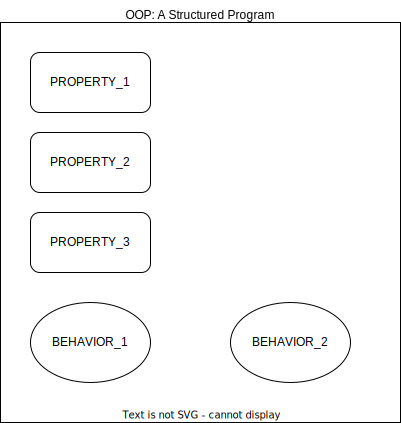

# Object Oriented Programming

Object oriented programming is a **programming paradigm** that provides a means of structuring programs so that **properties** and **behaviors** are bundled into individual **objects**. The following image represents the concept of object oriented programming - 

  

The variables are the properties are the variables and the functions are the behaviors and the structure they are contained in is called the object. From a programming point of view, the properties *define the object* whereas the behaviors *define the actions of the object*.  

For instance, an object could represent a person with **properties** like a name, age, and address and behaviors such as walking, talking, breathing, and running. Or it could represent an email with properties like a recipient list, subject, and body and behaviors like adding attachments and sending.  

OOP models real-world entities as software objects that have some data associated with them and can perform certain functions

### Classes vs Instances

In object oriented programming, a **class** is a blueprint for how something should be defined. It doesn’t actually contain any data. It is a **template** for a user defined data structure. While the class is the blueprint, an **instance** is an object that is built from a class and contains real data. An object is therefore an actual reperesentation of the class with real time information.  

In object oriented programming, an object is considered as an **instance** of the class.

##### Some Examples

- An animal can be considered as a class because it represents the blueprint or the template for all animals - dogs, cats, lions, cows etc. The specific animals themselves are the instances (or objects) of the animal class because they contain the actual information. When we point to something and say _this is an animal_ it does not make much sense but when we say _this is a dog_ it makes a lot of sense because of the information it conveys

- An employee of an organization can be considered as a class. The employee class will have properties like `employee_id`, `joining_date`, `designation`, `salary`, `projects`, `department` etc. and behaviors like `work()`, `report()` etc. Different types of employees will have different values of these properties and behaviors. Employees of the organization can be **developers**, **testers**, **managers**, **directors** etc. and these are the objects of the employee class.

- A class is like a form. An instance is like a form that has been filled out with information. Just like many people can fill out the same form with their own unique information, many instances can be created from a single class.


## Defining A Class

All class definitions start with the class keyword, which is followed by the name of the class and a colon. Any code that is indented below the class definition is considered part of the class’s body. The properties that all objects must have are defined in a method called `__init__()`. Every time a new object is created, `__init__()` sets the **initial state** of the object by assigning the values of the object’s properties.  

 > #### __init__() initializes each new instance of the class
 
We can give `__init__()` any number of parameters, but the first parameter will always be a variable called `self`. When a new class instance is created, the instance is automatically passed to the self parameter in `__init__()` so that new attributes can be defined on the object.  

For example: 

```python
class Hello:
    def __init__(self, some_variable):
        self.attribute = some_variable
```

**NOTE**
- The variables associated with a class are called **attributes**
- The variables that are associated with the instance of a class are called **instance variables** and the variables associated directly with the class are called **class variables**
- Functions inside a class are caled as **methods**

## Instantiating Objects

Creating a new object from a class is called instantiating an object. When a new object of a class is created, the Python compiler will fill in the values of the blueprint with the object specific information and store it in memory. Every object of a class is unique **even if they have the exact same data** and this is because every object of the class is stored in a unique memory address.  

Any changes to any object of a class will **not affect** other objects of the class. Any changes to the class will affect **every object** of that class. 

To instantiate a new object of a class type the name of the class followed by the paranthesis `()` for example:  

```python
# creating an object of the class Hello
obj = Hello("Hi There")
```  

Once the objects of a class have been instantiated the attributes of that object can be accessed via the dot notation `.` for example  

```python
print(obj.attribute)
```


```python
# Create a class Dog with two attributes - 'name' and 'age'
class Dog:
    
    # Initialize the attributes of the class
    def __init__(self, name, age):
        self.name = name
        self.age = age
```


```python
# Instantiate the objects of class Dog
dog1 = Dog("german_shepherd", 20)

# Accessing the attributes of dog_1
print(dog1.name)
print(dog1.age)

# EXERCISE
# Instantiate an object of the class Dog and print the attributes
# <---WRITE CODE HERE--->
```

    german_shepherd
    20


```python
# Create a class Employee with three attributes - 'employee_id', 'employee_name', 'joining_date'
def Employee():
    
    # Initialize the attributes of the class
    def __init__(self, eid, ename, doj):
        self.employee_id = eid
        self.employee_name = ename
        self.joining_date = doj
```


```python
# EXERCISE
# Instantiate an object of the class Employee and print the attributes
# <---WRITE CODE HERE--->
```


```python
# Create a class Student with three attributes - 'name', 'section', 'school'
# The attribute 'school' should be a initialized with a default parameter
class Student:
    
    # Initialize the attributes of the class
    def __init__(self, name, section, school="ABC SCHOOL"):
        self.name = name
        self.section = section
        self.school = school
```


```python
# Instantiating the object with default parameter
student = Student("Bob", "A")

# Accessing the attributes
print(student.name)
print(student.section)
print(student.school)
```

    Bob
    A
    ABC SCHOOL


```python
# EXERCISE
# Instantiate the object without default parameter and access the attributes
# <---WRITE CODE HERE--->
```


```python
# Create a class HelloWorld with two fixed attributes - 'attribute_1' and 'attribute_2'
# The class should also take a variable number of attributes if required
class HelloWorld:
    
    # Initialize the attributes of the class
    def __init__(self, var1, var2, **kwargs):
        self.attribute_1 = var1
        self.attribute_2 = var2
        
        # Initializing the variable list of attributes
        # We can use the _setattr__() method to initialize the attributes of a class
        for key, value in kwargs.items():
            self.__setattr__(key, value)
```


```python
d = {"key1": "value1", "key2": "value2", "key3": "value3"}

# Instantiate the object with variable of attributes
obj = HelloWorld("attribute", 100, **d)
```


```python
# Access the attributes of obj
print(obj.attribute_1)
print(obj.attribute_2)
print(obj.key1)
print(obj.key2)
print(obj.key3)
```

    attribute
    100
    value1
    value2
    value3


```python
# EXERCISE
# Instantiate the class HelloWorld() without any variable attributes and access them
# <---WRITE CODE HERE--->
```


```python
# EXERCISE
# Instantiate the class HelloWorld() with 4 variable attributes - key, item, date, timestamp
# Access all the attributes of the class
# <---WRITE CODE HERE--->
```


```python
class HelloWorld:
    
    def __init__(self, args1, args2):
        self.attr1 = args1
        self.attr2 = args2
        
obj1 = HelloWorld("data", 42)
obj2 = HelloWorld("data", 42)
```


```python
# Compare if the objects are equal or not
obj1 == obj2
```


    False


```python
# Verify the memory address of obj1 using id()
print(id(obj1))

# Verify the memory address of obj2 using id()
print(id(obj2))
```

    4457570192
    4457572496


### Quiz
##### Create a class **MusicalInstrument** with two attributes - `instrument_name`, `instrument_type`
- Instantiate and access the attributes of the class


```python
# <---WRITE CODE HERE--->
```

### Quiz
##### Create a class **Vehicle** with three attributes - `vehicle_type`, `vehicle_name`, `is_heavy`
- The attribute `is_heavy` is initialized with a default parameter set to **False**
- Instantiate and access the attributes of the class


```python
# <---WRITE CODE HERE--->
```

### Quiz
##### Create a class **Netflix** with three instance attributes followed by variable attributes
- The instance attributes will be `name`, `genre`, `rating`
- The variable attributes will have the keys - `language`, `release_date` and any other user defined keys of their choice
- Instantiate three objects of the Netflix class - first with variable attributes, second without variable attributes and third with 5 variable attributes
- Instantiate a fourth object of the Netflix class with the exact same data as the second object and compare both objects 


```python
# <---WRITE CODE HERE--->
```

### Class And Instance Attributes
- Attributes defined in `__init__()` are called instance attributes. An instance attribute’s value is specific to a particular instance of the class
- Attributes defined outside `__init()` but inside the class are called class attributes. They have the same value for all class instances
- Class attributes must always be assigned an initial value. When an instance of the class is created, class attributes are automatically created and assigned to their initial values
- Class attributes are used to define properties that should have the same value for every class instance
- Instance attributes for properties that vary from one instance to another


```python
class Dog:
    
    # Class attribute
    species = "dog"
    
    # Instance attributes
    def __init__(self, name, age):
        self.name = name
        self.age = age
```


```python
pit_bull = Dog("pit bull", 5)
print(pit_bull.species, pit_bull.name)

german_shepherd = Dog("german_shepherd", 7)
print(german_shepherd.species, german_shepherd.name)
```

    dog pit bull
    dog german_shepherd


```python
# Update the class attribute for one object
pit_bull.species = "cat"
pit_bull.name = "BOWSER"
```


```python
print(pit_bull.species, pit_bull.name)
print(german_shepherd.species, german_shepherd.name)
```

    cat BOWSER
    dog german_shepherd


#### Note
It is **not recommended** to use variable values as class attributes. Even if the class variable belongs to the class and every object of that class will have the same value for the class attribute, when the class variable is updated, the update is only applied to the object it was updated from. This is beacause at this point, the class attribute starts acting like instance attribute.  

Always use class attributes for values that will remain constant for every object of the class. Refer this link for more information on class and instance attributes [class-vs-instance-attributes](https://www.toptal.com/python/python-class-attributes-an-overly-thorough-guide)


```python
# The __dict__ property can be used on any object to view it's properties
pit_bull.__dict__
```


    {'name': 'BOWSER', 'age': 5, 'species': 'cat'}


```python
# The __dict__ property can be used on any class to view it's structure
Dog.__dict__
```


    mappingproxy({'__module__': '__main__',
                  'species': 'dog',
                  '__init__': <function __main__.Dog.__init__(self, name, age)>,
                  '__dict__': <attribute '__dict__' of 'Dog' objects>,
                  '__weakref__': <attribute '__weakref__' of 'Dog' objects>,
                  '__doc__': None})


```python
class Employee:
    
    # Class attributes
    company = "IQVIA"
    location = "BLR"
    
    # Instance attributes
    def __init__(self, employee_id, employee_name):
        self.employee_id = employee_id
        self.employee_name = employee_name
```


```python
# EXERCISE 
# Initialize the two objects of the class Employee and access all the attributes
# <---WRITE CODE HERE--->
```


```python
# Update the class attribute for one of the objects and access all the attributes again
# <---WRITE CODE HERE--->
```

#### Note
- Class attributes are initialized at the time of **creating the class**
- Instance attributes are initialized at the time of **creating the object of that class**


```python
class Demo:
    
    # Class attributes
    class_attribute
    
    # Instance attributes
    def __init__(self, var_1):
        self.instance_attribute_1 = var_1
        self.instance_attribute_2
```


    ---------------------------------------------------------------------------

    NameError                                 Traceback (most recent call last)

    Cell In[88], line 1
    ----> 1 class Demo:
          2     
          3     # Class attributes
          4     class_attribute
          6     # Instance attributes


    Cell In[88], line 4, in Demo()
          1 class Demo:
          2     
          3     # Class attributes
    ----> 4     class_attribute
          6     # Instance attributes
          7     def __init__(self, var_1):


    NameError: name 'class_attribute' is not defined


```python
demo = Demo(10)
print(demo.instance_attribute_1)
print(demo.instance_attribute_2)
```


    ---------------------------------------------------------------------------

    TypeError                                 Traceback (most recent call last)

    Cell In[89], line 1
    ----> 1 demo = Demo(10)
          2 print(demo.instance_attribute_1)
          3 print(demo.instance_attribute_2)


    TypeError: Demo.__init__() missing 1 required positional argument: 'var_2'


### Quiz
Create a class **Food** with the following structure:
- Three instance attributes - `type`, `calories`, `nutrition`
- Two class attributes - `target_group`, `is_processed`
- The instance variable `nutrition` should be initialized to a default list **["proteins", "carbs", "fat"]**
- The class attribute `is_processed` is a boolean value initialized to False


```python
# <---WRITE CODE HERE--->
```

## Instance Methods

Instance methods are functions that are defined inside a class and can only be called from an instance of that class. Just like `__init__()` an instance method’s first parameter is always **self**. An instance method has access to all the instance attributes that are defined in the class.  

A sample structure of instance method:

```python
class HelloWorld:
    
    def __init__(self, args):
        self.attr = args
        
    def foo():
        print("this is instance method")
```


```python
class Employee:
    
    def __init__(self, employee_id, employee_name, employee_type):
        self.employee_id = employee_id
        self.employee_name = employee_name
        self.employee_type = employee_type
        
    def activities(self):
        if self.employee_type == "developer":
            print("write code")
            print("test code")
            print("write documentation")
        
        elif self.employee_type == "manager":
            print("review code")
            print("review documentation")
            print("manage projects")
            
        else:
            print("come to office")
            
    def get_seating_plan(self):
        if self.employee_id % 2 == 0:
            print(f"employee {self.employee_name} will come to office on MONDAY and WEDNESDAY")
        else:
            print(f"employee {self.employee_name} will come to office on TUESDAY and THURSDAY")
    
    # Instance methods can update the contents of instance attributes
    def promote_employee(self):
        if self.employee_type == "developer":
            self.employee_type = "manager"
            print("PROMOTED!")
            
        else:
            self.employee_type = "director"
            print("PROMOTED")
            
    # Instance methods can take arguments from the user when called
    def get_project_access(self, designation):
        if (designation == "manager" or designation == "director") and self.employee_type == designation:
            print(f"{self.employee_name} with ID {self.employee_id} has project level access")
        else:
            print("ACCESS DENIED")
```


```python
developer = Employee(1001, "John", "developer")

# EXERCISE
# Instantiate two classes manager and director with employee_designation as "manager" and "director"
# <---WRTIE CODE HERE--->
```


```python
developer.__dict__
```


    {'employee_id': 1001, 'employee_name': 'John', 'employee_type': 'developer'}


```python
# EXERCISE
# Check the structure of manager object
# <---WRITE CODE HERE--->
```


```python
# EXERCISE
# Check the structure of director object
# <---WRITE CODE HERE--->
```


```python
# Calling the instance method activities()
developer.activities()
```

    write code
    test code
    write documentation


```python
# EXERCISE
# Call the instance method activities() on manager object
# Call the instance method get_seating_plan() on director object
```


```python
# Calling the instance method get_seating_plan()
developer.get_seating_plan()
```

    employee John will come to office on TUESDAY and THURSDAY


```python
# Calling the instance method get_project_access()
developer.get_project_access("developer")
developer.get_project_access("manager")
```

    ACCESS DENIED
    ACCESS DENIED


```python
# Calling the instance method promote_employee()
developer.promote_employee()
```

    PROMOTED!


```python
# View the object structure to verify if the employee got promoted
developer.__dict__
```


    {'employee_id': 1001, 'employee_name': 'John', 'employee_type': 'manager'}


```python
# Check for project access
developer.get_project_access("developer")
developer.get_project_access("manager")
developer.get_project_access("director")
```

    ACCESS DENIED
    John with ID 1001 has project level access
    ACCESS DENIED


```python
# EXERCISE
# Call the method get_project_access() with different arguments on manager and director object 
# <---WRITE CODE HERE--->
```


```python
# EXERCISE
# Call the method promote_employee() on manager object and print the object dict
# <---WRITE CODE HERE--->
```

### Quiz

##### Create a class **Student** with the following structure:
- Instance variables `student_name` `student_id` `student_type` and `marks`
    - Instance variable `student_type` is initialized with **default** parameters and set to **junior**
    - Instance variable `marks` is a list of 5 non-zero integers not exceeding 100
- Instance methods `student_activities()` `requires_extra_class()` `update_scores()` and `promote_student()`
    - Instance method `requires_extra_class()` returns true if the average score of a student is below 40
    - Instance method `update_scores()` will take an argument as list and update the scores 
    - Instance method `student_activities()` will return different set of activities based on the following student types: **junior**, **senior**, **monitor**, **captain**
    - Instance method `promote_student()` will take an argument and promote the students (logic is left to developer)
    
##### Instantiate multiple objects of the **Student** class based on the student types and call the different methods. Print the object dict for every object  
##### Promote the students and call the instance methods 


```python
# <---WRITE CODE HERE--->
```

## Inheritance

Inheritance is the process by which one class takes on the attributes and methods of another. Newly formed classes are called **child classes**, and the classes that child classes are derived from are called **parent classes**.  

Child classes can override or extend the attributes and methods of parent classes. In other words, child classes inherit all of the parent’s attributes and methods but can also specify attributes and methods that are unique to themselves.  

To inherit the properties of the parent class in Python, the child class is wrapped around paranthesis `()` and the parent class is provided inside the child class. To instantiate the parent class attributes from the child class, the `super()` method is called on the `__init__()` method with only the properties of the parent class being passed.   

To initialize properties of the child class the attributes are initialized as normal. Consider the below example:

```python
# Parent class definition
class Hello:
    def __init__(self, var):
        self.parent_attribute = var
        
# Child class definition
class HelloWorld(Hello):
    
    # Initializing the child class object
    def __init__(self, var, another_var):
        
        # The super() method is used inside the __init__() method of the child class
        # It will only initialize the parent object Hello
        super().__init__(var)
        
        # The attributes of HelloWorld are initialized like any other class
        self.child_attribute = another_var
        
# Instantiating the object
obj = HelloWorld("parent", "child")
```

#### Note
- The child class inherits **all** the attributes and methods of the parent class
- The child class can modify any of the inherited properties and also add it's own properties
- Inheritance is uni-directional in nature with the information flowing from Parent -> Child; this means that any changes to child class will not refelect in parent class but any changes to parent class will reflect in every child class that inherited from it


```python
# Create the Animal class
class Animal:
    
    def __init__(self, species, diet, habitat):
        self.species = species
        self.diet = diet
        self.habitat = habitat
        
    def sound(self, sound):
        print(f"{self.species} says {sound}")
        
    def activity(self, action):
        print(f"{self.species} spends a lot of time {action}")
```


```python
Animal.__dict__
```


    mappingproxy({'__module__': '__main__',
                  '__init__': <function __main__.Animal.__init__(self, species, diet, habitat)>,
                  'sound': <function __main__.Animal.sound(self, sound)>,
                  'activity': <function __main__.Animal.activity(self, action)>,
                  '__dict__': <attribute '__dict__' of 'Animal' objects>,
                  '__weakref__': <attribute '__weakref__' of 'Animal' objects>,
                  '__doc__': None})


```python
# Instantiate objects tiger of Animal class
tiger = Animal("tiger", "carnivore", "jungle")
tiger.__dict__
```


    {'species': 'tiger', 'diet': 'carnivore', 'habitat': 'jungle'}


```python
# Call the instance methods sound() and activity() on tiger object
tiger.sound("growl")
tiger.activity("hunting")
```

    tiger says growl
    tiger spends a lot of time hunting


```python
# EXERCISE
# Create the labrador object as per the above image
# Call the instance methods sound() and activity() on labrador object
# <---WRITE CODE HERE--->
```


```python
# Create the Dog class that inherits from the Animal class
class Dog(Animal):
    
    # The 'pass' keyword denotes code will go here in the future
    # Allows us to test code without breaking them
    # Since Dog inherits from Animal it has complete access to all it's properties
    pass
```


```python
Dog.__dict__
```


    mappingproxy({'__module__': '__main__', '__doc__': None})


```python
# Recreating the labrador object with inheritance
labrador = Dog("dog", "omnivore", "domestic")
labrador.__dict__
```


    {'species': 'dog', 'diet': 'omnivore', 'habitat': 'domestic'}


```python
# Dog class objects also have access to instance methods of Animal (parent class)
labrador.sound("woof")
labrador.activity("guarding the house")
```

    dog says woof
    dog spends a lot of time guarding the house


```python
# Creating the Dog class as per the image 
# Inherit the contents of Animal class
# Extend the features of it's own class
class Dog(Animal):
    
    # Use the super() method to instantiate the parent object
    def __init__(self, species, diet, habitat, breed, price, lifespan):
        super().__init__(species, diet, habitat)
        self.breed = breed
        self.price = price
        self.lifespan = lifespan
        
    # Ignore the methods sound()
    
    # Add new instance methods for Dog class
    def guard(self, is_guard):
        if is_guard:
            print(f"{self.breed} of species {self.species} is a guard dog")
        else:
            print(f"{self.breed} of species {self.species} is a not a guard dog")
        
    def hunt(self, is_trained):
        if is_trained:
            print(f"{self.breed} of species {self.species} is a hunting dog")
        else:
            print(f"{self.breed} of species {self.species} is not a hunting dog")
            
    # Modify the activity() instance method inheirted from parent class
    # This will not affect the original method in Animal class
    def activity(self, action):
        print(f"{self.species} breed {self.breed} spends a lot of time {action}")
```


```python
Dog.__dict__
```


    mappingproxy({'__module__': '__main__',
                  '__init__': <function __main__.Dog.__init__(self, species, diet, habitat, breed, price, lifespan)>,
                  'guard': <function __main__.Dog.guard(self, is_guard)>,
                  'hunt': <function __main__.Dog.hunt(self, is_trained)>,
                  'activity': <function __main__.Dog.activity(self, action)>,
                  '__doc__': None})


```python
# Create object chihuahua of the class Dog 
chihuahua = Dog("dog", "herbivore", "domestic", "chihuahua", "expensive", 10)
chihuahua.__dict__
```


    {'species': 'dog',
     'diet': 'herbivore',
     'habitat': 'domestic',
     'breed': 'chihuahua',
     'price': 'expensive',
     'lifespan': 10}


```python
# Call the parent class instance methods
chihuahua.sound("woof")
chihuahua.activity("relaxing")
```

    dog says woof
    dog breed chihuahua spends a lot of time relaxing


```python
# EXERCISE
# Instantiate any object for Animal class and call the activity() method 
```


```python
# Call the Dog class instance methods
chihuahua.guard(False)
chihuahua.hunt(False)
```

    chihuahua of species dog is a not a guard dog
    chihuahua of species dog is not a hunting dog


```python
# EXERCISE
# Instantiate any object from the Dog class and call the activity() method
# <---WRITE CODE HERE--->
```

### Quiz
##### Create a class **Cow** that inherits from the class **Animal** with the following properties:
- It has additional instance variables `breed` and `is_domesticated`
- The attribute `is_domesticated` should be initialized with default parameters set to **True**
- It should have instance methods `graze()` and `farming()` - both implementations are left to the developer
- It should override the parent class method `activity()` but keep the method `sound()` unchanged
- Instantiate multiple breeds of the Cow object and check the outputs

### An Overview Of `super()`

- `super()` alone returns a temporary object of the superclass that then allows you to call that superclass’s methods
- Calling the previously built methods with `super()` saves you from needing to rewrite those methods in your subclass, and allows you to swap out superclasses with minimal code changes
- The `super()` class is often used to call the __init__() of the parent class, allowing you to use it in the child class without repeating code

Consider the below code:

```python
class Rectangle:
    def __init__(self, length, width):
        self.length = length
        self.width = width

    def area(self):
        return self.length * self.width

    def perimeter(self):
        return 2 * self.length + 2 * self.width

class Square:
    def __init__(self, length):
        self.length = length

    def area(self):
        return self.length * self.length

    def perimeter(self):
        return 4 * self.length
```

The above classes can be used as: 

```shell
>>> square = Square(4)
>>> square.area()
16
>>> rectangle = Rectangle(2, 4)
>>> rectangle.area()
8
```


```python
class Rectangle:
    def __init__(self, length, width):
        self.length = length
        self.width = width

    def area(self):
        return self.length * self.width

    def perimeter(self):
        return 2 * self.length + 2 * self.width

# Here we declare that the Square class inherits from the Rectangle class
class Square(Rectangle):
    def __init__(self, length):
        super().__init__(length, length)
```


```python
square = Square(4)
square.area()
```


    16


```python
# Create a class Cube that inherits from the class Square
# This is multi-level inheritance because Square itself inherits from Rectangle
class Cube(Square):
    def surface_area(self):
        face_area = super().area()
        return face_area * 6

    def volume(self):
        face_area = super().area()
        return face_area * self.length
```


```python
# Instantiate the cube object
cube = Cube(3)
```


```python
# Call the instance methods of cube
print(f"surface area of cube {cube.surface_area()}")
print(f"volume of cube {cube.volume()}")
```

    surface area of cube 54
    volume of cube 27


```python
# Call the parent class methods of cube
print(f"area of cube {cube.area()}")
print(f"perimeter of cube {cube.perimeter()}")
```

    area of cube 9
    perimeter of cube 12


### Quiz
##### Create a class **Circle**, **Sphere** and **Cylinder** as per the following requirements:
- The class **Sphere** and class **Cylinder** inherits from the class circle
- The class **Circle** and **Sphere** takes only one instance variable - `radius`
- The class **Cylinder** takes two instance variables - `radius` and `height`
- The class **Circle** has a class attribute `PI` which is initialized to 3.14
- The **Circle** class contains methods `area()` and `circumference()` and return appropriate results 
    - area of a circle: ${\pi*radius^2}$
    - circumference of a circle: ${2*\pi*radius}$
- The **Sphere** and **Cylinder** class contains methods `volume()` and `surface_area()`
    - volume of a sphere: ${\frac{4}{3}*\pi*radius^3}$
    - volume of a cylinder: ${\pi*radius^2*height}$
    - surface area of a sphere: ${4*\pi*radius^2}$
    - volume of a sphere: ${2*\pi*radius*height + 2*\pi*radius^2}$
    
##### Instantiate objects `sphere` `cylinder` and `circle` for the above objects and print the area, circumference, surface area and volume of all

### Multi Level Inheritance

In multi level inheritance, one class inherits from another class which in turn inheirts from another class in a cascading way. In effect, for a three-level inheritence, the topmost class is the _grandparent_ whereas the middle class that inherits from _grandparent_ is called _parent_ and the lowest class on the level which inherits from the _parent_ is the _child_ class.  

In this type of inheritance the inheriting class will receive **all the properties** of every class above it (for example the child class receives the properties of the parent and the grandparent classes). 


```python
class Hello:
    
    def __init__(self, var):
        self.instance_1 = var
        
    def f(self):
        print(f"instance_1: {self.instance_1}")
        
class HelloWorld(Hello):
    
    def __init__(self, var_1, var_2):
        super().__init__(var_1)
        self.instance_2 = var_2
        
    def g(self):
        super().f()
        print(f"instance_2: {self.instance_2}")
        
class HelloHelloWorld(HelloWorld):
    
    def __init__(self, var_1, var_2, var_3):
        super().__init__(var_1, var_2)
        self.instance_3 = var_3
        
    def h(self):
        super().g()
        print(f"instance_3: {self.instance_3}")
```


```python
ob1 = Hello("grandparent")
ob1.f()
```

    instance_1: grandparent


```python
ob2 = HelloWorld("grandparent", "parent")
ob2.f()
```

    instance_1: grandparent


```python
ob2.g()
```

    instance_1: grandparent
    instance_2: parent


```python
ob3 = HelloHelloWorld("grandparent", "parent", "child")
ob3.f()
```

    instance_1: grandparent


```python
ob3.g()
```

    instance_1: grandparent
    instance_2: parent


```python
ob3.h()
```

    instance_1: grandparent
    instance_2: parent
    instance_3: child


### Quiz
- ##### Modify the class **Cylinder** to inherit from the class **Sphere** instead
- ##### Override the method `surface_area()` of the parent class **Sphere** in the child class **Cylinder** to calculate the surface area

### Quiz
##### Create a new class **HuntingDog** that inherits from the parent class **Dog**. The class **Dog** itself inherits from the class **Animal**. Instantiate at least two objects of each class, override required methods and use `super()` wherever required.

##### Note
- Method overriding is left to the discretion of the developers
- Refer the above image in **multi-level inheritance** section for an idea on the attributes and methods to design the classes

## Conclusion

### Why Object Oriented Programming?

Let us assume we have employee data for 1000s of employees in a company. Each employee data resides in a list as follows:

```python
bob = ['bob sinclair', 1001, 'bob@example.com', 'IT']
jane = ['jane doe', 4032, 'jane@example.com', 'IT']
robby = ['robby smith', 3000, 'rsmith@example.com', 'SALES']
```

Now, it becomes difficult to keep a track of all employee data like this. It becomes even more difficult when a new attribute has to be added because then the developer has to manually iterate over every list and add the new attribute. Moreover, it is up to the developer to remember the order of the attributes stored in the list and any list with incorrect order of attributes will lead to unexpected errors. 

A better approach will be:  

```python
class Employee:
    
    def __init__(self, name, eid, email, dept, **kwargs):
        self.name = name
        self.eid = eid
        self.email = email
        self.dept = dept
        
        for key, value in kwargs.items():
            self.__setattr__(key, value)
        
bob = Employee('bob sinclair', 1001, 'bob@example.com', 'IT')
jane = Employee('jane doe', 4032, 'jane@example.com', 'IT')
```  

If in the future new employee attributes are to be added they can simply be added as: 

```python
bob = Employee('bob sinclair', 1001, 'bob@example.com', 'IT', **{"manager": "kim", "status": "full-time"})
jane = Employee('jane doe', 4032, 'jane@example.com', 'IT', **{"status": "contractor"})
```


```python
class Employee:
    
    def __init__(self, name, eid, email, dept, **kwargs):
        self.name = name
        self.eid = eid
        self.email = email
        self.dept = dept
        
        for key, value in kwargs.items():
            self.__setattr__(key, value)
```


```python
bob = Employee('bob sinclair', 1001, 'bob@example.com', 'IT')
bob.__dict__
```


    {'name': 'bob sinclair', 'eid': 1001, 'email': 'bob@example.com', 'dept': 'IT'}


```python
jane = Employee('jane doe', 4032, 'jane@example.com', 'IT')
jane.__dict__
```


    {'name': 'jane doe', 'eid': 4032, 'email': 'jane@example.com', 'dept': 'IT'}


```python
bob = Employee('bob sinclair', 1001, 'bob@example.com', 'IT', **{"manager": "kim", "status": "full-time"})
bob.__dict__
```


    {'name': 'bob sinclair',
     'eid': 1001,
     'email': 'bob@example.com',
     'dept': 'IT',
     'manager': 'kim',
     'status': 'full-time'}


```python
jane = Employee('jane doe', 4032, 'jane@example.com', 'IT', **{"status": "contractor"})
jane.__dict__
```


    {'name': 'jane doe',
     'eid': 4032,
     'email': 'jane@example.com',
     'dept': 'IT',
     'status': 'contractor'}


### Important Links For Reference
- [Real Python - Object Oriented Programming](https://realpython.com/python3-object-oriented-programming/)
- [Real Python - Super Keyword](https://realpython.com/python-super/) 
